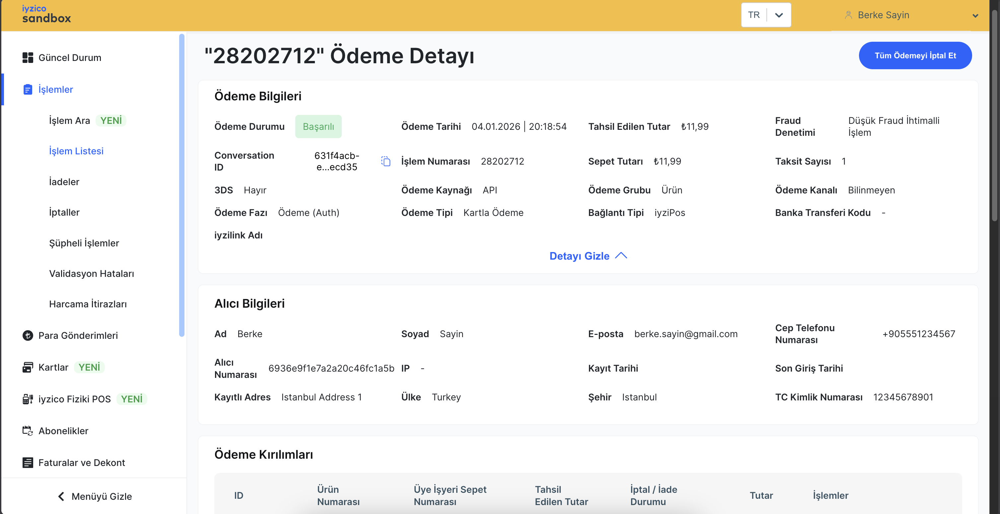

# Payment Details

`iyizpay` API Java client developed by `iyzico` is used at `payment` service. 

### Use Iyzipay To Create Payment 

`IyzipayService.java` &rarr; `createPayment(String customerId)`

```java
// create payment using the injected options
Payment payment = Payment.create(request, useIyzipayOptions);
```

### Retrieve Payment Details 

`IyzipayService.java` &rarr; `getPaymentDetails(String paymentId)`

```java
// retrieve payment using the injected options
Payment payment = Payment.retrieve(request, useIyzipayOptions);
```

`Request`: `GET  http://localhost:8222/api/v1/payments/28202712`

Response:

```json
{
    "paymentId": "28202712",
    "conversationId": null,
    "status": "success",
    "paymentStatus": "SUCCESS",
    "phase": "AUTH",
    "systemTime": 1767897734411,
    "authCode": "285439",
    "hostReference": "mock00030iyzihostrfn",
    "connectorName": null,
    "fraudStatus": 1,
    "mdStatus": null,
    "price": 11.99000000,
    "paidPrice": 11.99000000,
    "currency": "TRY",
    "installment": 1,
    "basketId": null,
    "cardDetail": {
        "cardHolderName": null,
        "binNumber": "516888",
        "lastFourDigits": "0002",
        "cardType": "DEBIT_CARD",
        "cardAssociation": "MASTER_CARD",
        "cardFamily": "Tlcard",
        "bankName": null
    },
    "commissionDetail": {
        "merchantCommissionRate": 0E-8,
        "merchantCommissionRateAmount": 0E-8,
        "iyziCommissionRateAmount": 0.13189000,
        "iyziCommissionFee": 0.25000000
    },
    "items": [
        {
            "itemId": "6283",
            "paymentTransactionId": "30162851",
            "price": 11.99000000,
            "paidPrice": 11.99000000,
            "transactionStatus": 2
        }
    ],
    "errorMessage": null
}
```

`Dashboard`


